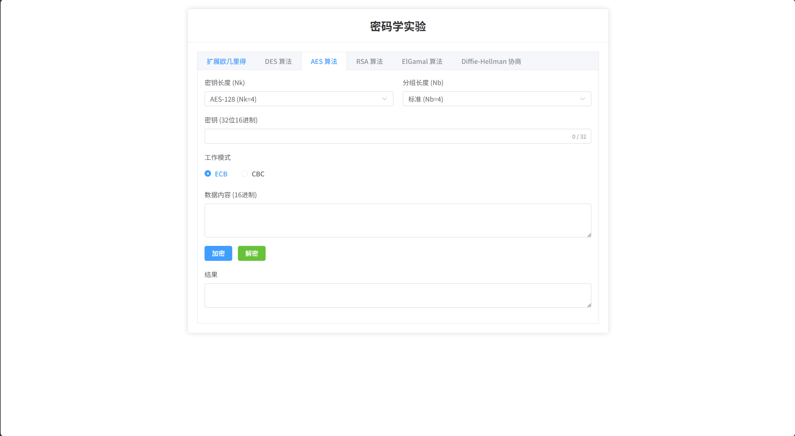

# 东南大学-密码学实验
东南大学密码学课程实验二项目，包含前端交互界面与后端密码学算法

```text
.
├── backend/            # 后端服务端代码 (Node.js)
│   ├── bin/
│   ├── package.json
│   └── server.js       # 后端服务入口
├── frontend/           # 前端界面代码 (Vue)
│   ├── src/            # 前端源码
│   ├── public/
│   └── package.json
└── README.md

```

## 环境准备
在运行项目之前，请确保本地已安装：
Node.js (建议 v16.x 或以上版本)
npm 或 yarn

## 运行指南
需要分别启动后端服务和前端服务。
### 1. 启动后端 (Backend)
Bash
#### 进入后端目录
cd backend
#### 安装后端依赖
npm install
#### 启动后端服务
npm start
#### 或者使用 node server.js
后端服务默认运行在：http://localhost:3000
### 2. 启动前端 (Frontend)
打开一个新的终端窗口：
Bash
#### 进入前端目录
cd frontend
####安装前端依赖
npm install
#### 启动开发服务器
npm run dev
前端服务默认运行在：http://localhost:5173


